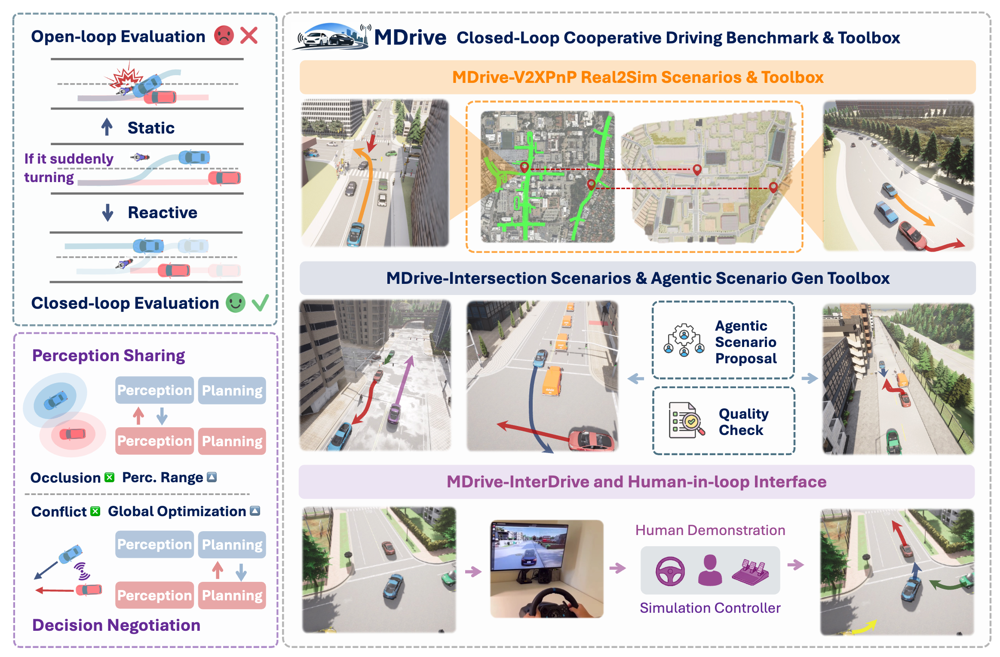

#  MDrive

[](hhttps://mdrive-challenge.github.io/)
[](https://arxiv.org/pdf/2605.10904)
[]()

This is the official implementation of the paper:

**MDrive: Benchmarking Closed-Loop Cooperative Driving for End-to-End Multi-agent Systems**

[Marco Coscoy](https://www.linkedin.com/in/marco-coscoy-592670266/)\*, [Zewei Zhou](https://zewei-zhou.github.io/)\*‡, [Seth Z. Zhao](https://sethzhao506.github.io/)*‡, [Henry Wei](https://www.linkedin.com/in/henrywei8/), [Angela Magtoto](https://www.linkedin.com/in/angelamagtoto/), [Johnson Liu](https://www.linkedin.com/in/johnsonliu367/), [Rui Song](https://rruisong.github.io/)<sup>†</sup>, [Walter Zimmer](https://walzimmer.github.io/), [Zhiyu Huang](https://mczhi.github.io/), [Chen Tang](https://chentangmark.github.io/), [Bolei Zhou](https://boleizhou.github.io/), [Jiaqi Ma](https://mobility-lab.seas.ucla.edu/about/)

University of California, Los Angeles, USA | <sup>*</sup> Equal contribution. <sup>‡</sup> Project lead. <sup>†</sup> Corresponding author.


<!-- A closed-loop cooperative driving benchmark with diverse interaction scenarios, and systematically analyze the V2X benefits across perception sharing and decision negotiation. -->
                         
<p align="center">
  
</p>

## Overview

MDrive is a closed-loop cooperative driving benchmark for end-to-end multi-agent systems. It targets two cooperative paradigms that are otherwise hard to evaluate together: **perception sharing** (CAVs and infrastructure share complementary detections to mitigate occlusion and extend range) and **decision negotiation** (CAVs negotiate intent at conflict points for proactive coordination).

The benchmark comprises **225 scenarios** across three complementary buckets:

- **MDrive-V2XPnP** (67) — Real2Sim reconstructions from real-world V2X driving logs, with realistic background traffic.
- **MDrive-Interaction** (112) — interaction-rich scenarios with reactive background traffic. Comprises 100 agentic-generated scenarios across 10 interaction categories (highway on-ramp merge, intersection deadlock, roundabout, pedestrian crosswalk, work zones, etc.) plus 12 pre-crash scenarios grounded in NHTSA pre-crash typologies.
- **MDrive-InterDrive** (46) — multi-agent negotiation scenarios from the InterDrive benchmark, used as in-domain reference.

Alongside the benchmark, we release the **MDrive-Toolbox**: a Real2Sim conversion pipeline, an agentic scenario generation pipeline, and a human-in-the-loop simulation interface. See [MDrive Toolbox](#mdrive-toolbox) below.

---

## Table of Contents
- [Quickstart](#quickstart)
- [Running Evaluations](#running-evaluations)
  - [Planners](#planners)
  - [Scenario Buckets](#scenario-buckets)
  - [Open-Loop Evaluation](#open-loop-evaluation)
  - [V2X-PnP with Infrastructure LiDAR](#v2x-pnp-with-infrastructure-lidar)
  - [Scenario Pool (Parallel Runs)](#scenario-pool-parallel-runs)
- [Results Analysis and Visualization](#results-analysis-and-visualization)
  - [Results Analysis](#results-analysis)
  - [Visualizing Results](#visualizing-results)
- [Baseline Evaluation Setup](#baseline-evaluation-setup)
  - [Evaluation of baselines](#evaluation-of-baselines)
  - [TCP Environment Setup](#tcp-environment-setup)
  - [CoDriving Environment Setup](#codriving-environment-setup)
  - [LMDrive Environment Setup](#lmdrive-environment-setup)
  - [UniAD Environment Setup](#uniad-environment-setup)
  - [VAD Environment Setup](#vad-environment-setup)
  - [CoLMDriver Environment Setup](#colmdriver-environment-setup)
  - [CoLMDriver Model Setup](#colmdriver-model-setup)
- [MDrive Toolbox](#mdrive-toolbox)
  - [Agentic Scenario Generation Pipeline](#agentic-scenario-generation-pipeline)
  - [Human-in-the-Loop Simulation Interface](#human-in-the-loop-simulation-interface)
  - [Real2Sim Pipeline](#real2sim-pipeline)

---
## Quickstart

### 1) Download and set up CARLA
Use the setup script below. It applies compatibility fixes, so start CARLA from this install.

```bash
./download_and_setup_carla.sh
export CARLA_ROOT=$PWD/carla912
```

### 2) (Custom planner only) Create baseline eval environment

Only needed if you're developing your own planner submission. For the built-in planners (CoLMDriver, CoDriving, TCP, etc.), activate the planner-specific env from [Baseline Evaluation Setup](#baseline-evaluation-setup) instead.

```bash
conda env create -f model_envs/run_custom_eval_baseline.yaml --solver libmamba
conda activate run_custom_eval_baseline
```

### 3) Start CARLA (manual or auto)

Either start CARLA in its own terminal:
```bash
$CARLA_ROOT/CarlaUE4.sh --world-port=2014 -RenderOffScreen
```

Or skip this step and pass `--start-carla` to `run_custom_eval.py` in step 4 — it will launch CARLA from `CARLA_ROOT/carla912` for you.

### 4) Run benchmark scenarios

Pick a planner with `--planner` (see [Planners](#planners)) and a scenario bucket with `--routes-dir`. The four buckets live under `scenarioset/`:

```bash
python tools/run_custom_eval.py \
  --planner colmdriver \
  --routes-dir scenarioset/interaction
```

For parallelization, open-loop mode, and infrastructure LiDAR, see [Running Evaluations](#running-evaluations).

---

## Running Evaluations

### Planners

Pick a planner with `--planner <name>`. Pass the flag multiple times to run several planners on the same scenarios in one command. Each planner has a default agent file and config; see [`tools/run_custom_eval.py`](tools/run_custom_eval.py) (`PLANNER_SPECS`) for the full list.

| Planner | What it is |
|---|---|
| `colmdriver`, `colmdriver_rulebase` | LLM-based negotiation (CoLMDriver) and its rule-based ablation |
| `codriving` | Cooperative perception + planning (CoDriving / V2Xverse) |
| `tcp`, `lmdrive`, `uniad`, `vad` | Single-agent baselines |
| `perception_swap_{fcooper,attfuse,disco,cobevt}` | Swap-detector cooperative perception variants for the perception study |

The `perception_swap_*` agents come in two local-planner variants. The default wraps CARLA's `BasicAgent`. The `_behavior` variants (e.g., `perception_swap_attfuse_behavior`) use the OpenCDA-derived `BehaviorAgent` for richer lane-keeping and obstacle avoidance.

```bash
python tools/run_custom_eval.py \
  --planner perception_swap_attfuse_behavior \
  --routes-dir scenarioset/interaction
```

### Scenario Buckets

The four bucket directories under `scenarioset/`:

| Directory | Count | Description |
|---|---|---|
| `scenarioset/interdrive` | 46 | InterDrive multi-agent negotiation (in-domain reference) |
| `scenarioset/interaction` | 112 | Agentic-generated interaction scenarios (10 categories × 10) + 12  NHTSA-grounded pre-crash scenarios|
| `scenarioset/v2xpnp` | 67 | Real2Sim from V2X-PnP logs |

Run a bucket by passing its directory to `--routes-dir`:
 
```bash
python tools/run_custom_eval.py --planner colmdriver --routes-dir scenarioset/v2xpnp
```

### Open-Loop Evaluation

Pass `--openloop` to collect open-loop perception (AP) and planning (ADE, collision rate) metrics.

```bash
python tools/run_custom_eval.py \
  --planner perception_swap_attfuse \
  --routes-dir scenarioset/v2xpnp \
  --openloop
```

See [`tools/openloop_post_metrics.py`](tools/openloop_post_metrics.py) for AP/ADE/CR aggregation.

### V2X-PnP with Infrastructure LiDAR

Pass `--infra-collab` to enable two stationary infrastructure LiDAR sensors at V2XPnP map intersection poses (see [`simulation/leaderboard/team_code/infra_lidar_config.py`](simulation/leaderboard/team_code/infra_lidar_config.py)). Their point clouds feed into each planner's cooperative fusion path alongside ego/RSU LiDAR. Has no effect on non-`v2xpnp` scenarios.

```bash
python tools/run_custom_eval.py \
  --planner colmdriver \
  --routes-dir scenarioset/v2xpnp \
  --infra-collab
```

### Scenario Pool (Parallel Runs)

For sweeping many planners or buckets on a multi-GPU box, add `--scenario-pool`. The orchestrator maintains a pool of long-lived CARLA instances (sized dynamically by VRAM) and dispatches scenarios concurrently across them with town-affinity reuse — much faster than the per-planner serial default.

```bash
python tools/run_custom_eval.py \
  --planner colmdriver \
  --planner perception_swap_attfuse \
  --planner codriving \
  --routes-dir scenarioset/interaction \
  --gpus 0,1,2,3 \
  --scenario-pool
```

Recommended whenever you're running more than ~10 scenarios or more than one planner.

---

## Results Analysis and Visualization

### Results Analysis
Use `visualization/results_analysis.py` on any results folder, not just MDrive outputs.

```bash
# Single run folder
python visualization/results_analysis.py \
  results/results_driving_custom/<run_tag> \
  --output-dir report/<run_tag>

# Compare multiple run folders and export one markdown summary
python visualization/results_analysis.py \
  results/results_driving_custom/<run_tag_a> \
  results/results_driving_custom/<run_tag_b> \
  --output-dir report/compare \
  --markdown report/compare/summary.md
```

The script generates markdown/CSV summaries and plots (driving score, success rate, infractions, negotiation stats when available).

### Visualizing Results
```bash
# Build a video from one scenario result folder
python visualization/gen_video.py \
  results/results_driving_custom/<run_tag>/<scenario_name>/<route_run_dir> \
  --output <scenario_name>.mp4
```

Optional flags include `--fps`, `--width`, `--height`, and `--font-scale`.

---

## Baseline Evaluation Setup

### Evaluation of baselines
Setup and get ckpts.

| Methods   | TCP | CoDriving               |
|-----------|---------|---------------------------|
| Installation Guide  | [github](https://github.com/OpenDriveLab/TCP)  | [github](https://github.com/CollaborativePerception/V2Xverse) |
| Checkpoints     |  [google drive](https://drive.google.com/file/d/1D-10aMUAOPk1yiOr-PvSOJMS_xi_eR7U/view?usp=sharing)  |  [google drive](https://drive.google.com/file/d/1Izg9wZ3ktR-mwn7J_ZqxrwBmtI1YJ6Xi/view?usp=sharing)   |

The downloaded checkpoints should follow this structure:
```Shell
|--MDrive
    |--ckpt
        |--codriving
            |--perception
            |--planning
        |--TCP
            |--new.ckpt
```

### TCP Environment Setup
1. **Create TCP conda environment**
```bash
cd MDrive
conda env create -f model_envs/tcp_codriving.yaml -n tcp_codriving
conda activate tcp_codriving
```
2. **Set CARLA path environment variables**
```bash
export CARLA_ROOT=PATHTOYOURREPOROOT/MDrive/carla912
export PYTHONPATH=$CARLA_ROOT/PythonAPI:$CARLA_ROOT/PythonAPI/carla:$CARLA_ROOT/PythonAPI/carla/dist/carla-0.9.12-py3.7-linux-x86_64.egg
```

### CoDriving Environment Setup
1. **Create CoDriving conda environment**
```bash
cd MDrive
conda env create -f model_envs/tcp_codriving.yaml -n tcp_codriving
conda activate tcp_codriving
```
2. **Set CARLA path environment variables**
```bash
export CARLA_ROOT=PATHTOYOURREPOROOT/MDrive/carla912
export PYTHONPATH=$CARLA_ROOT/PythonAPI:$CARLA_ROOT/PythonAPI/carla:$CARLA_ROOT/PythonAPI/carla/dist/carla-0.9.12-py3.7-linux-x86_64.egg
```

### LMDrive Environment Setup

1. **Clone LMDrive into the assets directory**
```bash
git clone https://github.com/opendilab/LMDrive simulation/assets/LMDrive
```

2. **Prepare LMDrive checkpoints**
```bash
cd simulation/assets/LMDrive
mkdir -p ckpt
```

Download and place the following into `simulation/assets/LMDrive/ckpt`:
- Vision encoder: https://huggingface.co/OpenDILabCommunity/LMDrive-vision-encoder-r50-v1.0  
- LMDrive LLaVA weights: https://huggingface.co/OpenDILabCommunity/LMDrive-llava-v1.5-7b-v1.0  

Download and place the following into `MDrive/ckpt/llava-v1.5-7b`:
- Base LLaVA model: https://huggingface.co/liuhaotian/llava-v1.5-7b  

3. **Create environment and install dependencies**
```bash
cd MDrive
conda env create -f model_envs/lmdrive.yaml -n lmdrive
conda activate lmdrive

pip install carla-birdeye-view==1.1.1 --no-deps
pip install -e simulation/assets/LMDrive/vision_encoder
```

4. **Set CARLA path environment variables**
```bash
export CARLA_ROOT=PATHTOYOURREPOROOT/MDrive/carla912
export PYTHONPATH=$CARLA_ROOT/PythonAPI:$CARLA_ROOT/PythonAPI/carla:$CARLA_ROOT/PythonAPI/carla/dist/carla-0.9.12-py3.7-linux-x86_64.egg
```

### UniAD Environment Setup

UniAD is a unified perception–prediction–planning autonomous driving model.  
We evaluate it on the InterDrive benchmark using its official pretrained weights and a standardized conda environment to avoid dependency conflicts.

To ensure consistent and reproducible evaluation of the UniAD baseline model, we standardize the environment setup using a pre-built conda environment.
This avoids dependency conflicts and ensures that anyone can run UniAD without rebuilding environments from scratch.

The YAML file for the UniAD environment is located in:

`model_envs/uniad_env.yaml`

To create and activate the environment:

```bash
conda env create -f model_envs/uniad_env.yaml -n uniad_env
conda activate uniad_env
```

UniAD runs inside the `uniad_env` conda environment, which contains all required CUDA, PyTorch, CARLA, and UniAD dependencies.

#### Additional Files

Create a ckpt/UniAD directory if it does not exist:
`mkdir -p MDrive/ckpt/UniAD`

Download the UniAD checkpoint from https://huggingface.co/rethinklab/Bench2DriveZoo/blob/main/uniad_base_b2d.pth
and place it here:

`MDrive/ckpt/UniAD/uniad_base_b2d.pth`

Download the UniAD config file from https://github.com/Thinklab-SJTU/Bench2DriveZoo/blob/uniad/vad/adzoo/uniad/configs/stage2_e2e/base_e2e_b2d.py and place it in:

`simulation/assets/UniAD/base_e2e_b2d.py`

### VAD Environment Setup

The YAML file for the VAD environment is located in:

`model_envs/vad_env.yaml`

1. **Create VAD conda environment**
```bash
cd MDrive
conda env create -f model_envs/vad_env.yaml -n vad
conda activate vad
```
#### **2. Start a Carla Instance**
```bash
CUDA_VISIBLE_DEVICES=0 $CARLA_ROOT/CarlaUE4.sh --world-port=2000 -prefer-nvidia
```

3. **Run VAD on Interdrive**
```bash
# CARLA must already be running on port 2000
bash scripts/eval/eval_mode.sh 0 2000 vad ideal Interdrive_all
```

### CoLMDriver Environment Setup

Use this section only for CoLMDriver-specific workflows.

#### vLLM env
```Shell
conda create -n vllm python=3.10
conda activate vllm
pip install vllm
```

#### CoLMDriver env
```Shell
conda create --name colmdriver python=3.7 cmake=3.22.1
conda activate colmdriver
conda install pytorch==1.10.1 torchvision==0.11.2 torchaudio==0.10.1 cudatoolkit=11.3 -c pytorch -c conda-forge
conda install cudnn -c conda-forge

pip install -r opencood/requirements.txt
pip install -r simulation/requirements.txt
pip install openai
```

#### Install Spconv (1.2.1)
We use spconv 1.2.1 to generate voxel features in the CoLMDriver perception stack.

```Shell
conda activate colmdriver
conda install -y cmake=3.22.1 ninja boost ccache -c conda-forge
pip install pybind11 numpy

git clone -b v1.2.1 --recursive https://github.com/traveller59/spconv.git
cd spconv
python setup.py bdist_wheel
pip install dist/spconv-1.2.1-*.whl
cd ..
```

#### Finish CoLMDriver local build setup
```Shell
conda activate colmdriver
python setup.py develop
python opencood/utils/setup.py build_ext --inplace
```

#### Install pypcd
```Shell
git clone https://github.com/klintan/pypcd.git
cd pypcd
pip install python-lzf
python setup.py install
cd ..
```

### CoLMDriver Model Setup

**Step 1:** Download checkpoints from [Google drive](https://drive.google.com/file/d/1z3poGdoomhujCNQtoQ80-BCO34GTOLb-/view?usp=sharing). The downloaded checkpoints of CoLMDriver should follow this structure:
```Shell
|--MDrive
    |--ckpt
        |--colmdriver
            |--LLM
            |--perception
            |--VLM
            |--waypoints_planner
```

To download the checkpoints through command line and move them into the correct directories (no GUI required):
```Shell
# In MDrive repository directory, with colmdriver conda env activated
pip install gdown
gdown 1z3poGdoomhujCNQtoQ80-BCO34GTOLb-

mkdir ckpt
mv colmdriver.zip ckpt
cd ckpt
unzip colmdriver.zip
rm colmdriver.zip

# Fix obsolete dataset dependency bug
sed -i "s|root_dir: .*|root_dir: $(pwd)|; s|test_dir: .*|test_dir: $(pwd)|; s|validate_dir: .*|validate_dir: $(pwd)|" colmdriver/percpetion/config.yaml
touch dataset_index.txt
```

**Step 2:** Running VLM, LLM (from repository root)
```Shell
#Enter conda ENV
conda activate vllm
# VLM on call
CUDA_VISIBLE_DEVICES=6 vllm serve ckpt/colmdriver/VLM --port 1111 --max-model-len 8192 --trust-remote-code --enable-prefix-caching

# LLM on call (in new terminal, with vllm env activated)
CUDA_VISIBLE_DEVICES=7 vllm serve ckpt/colmdriver/LLM --port 8888 --max-model-len 4096 --trust-remote-code --enable-prefix-caching
```
**Make sure that the CUDA_VISIBLE_DEVICES variable is set to a GPU available, which can be checked using the ```nvidia-smi``` command**

Note: make sure that the selected ports (1111,8888) are not occupied by other services. If you use other ports, please modify values of key 'comm_client' and 'vlm_client' in `simulation/leaderboard/team_code/agent_config/colmdriver_config.yaml` accordingly.

---

## MDrive Toolbox

### Agentic Scenario Generation Pipeline

Part of **MDrive-Toolbox**. A language agent emits a structured *scenario description* (topology, behavior arrangement, actor instantiation) grounded in human instructions and in-context expert demonstrations. Proposals are validated via deterministic rules in CARLA, and outputs are exported as CARLA-format scenario directories ready for closed-loop evaluation.

The pipeline ships with 10 interaction categories (highway on-ramp merge, intersection deadlock, roundabout, pedestrian crosswalk, work zones, etc.) yielding 100 of the 112 scenarios in the `MDrive-Interaction` bucket (the remaining 12 are the NHTSA pre-crash scenarios in `scenarioset/precrash/`). The pipeline is **extensible**: new categories can be added by extending [`scenario_generator/scenario_generator/capabilities.py`](scenario_generator/scenario_generator/capabilities.py) with new topology features and interaction primitives.

Code: [`scenario_generator/`](scenario_generator/), entry point [`scenario_generator/start_pipeline.py`](scenario_generator/start_pipeline.py).

```bash
python scenario_generator/start_pipeline.py --category "Highway On-Ramp Merge" --seed 42
```

Stop early at any of the 10 pipeline stages via `--stop-after <stage>`. See [`scenario_generator/SCENARIO_PIPELINE.md`](scenario_generator/SCENARIO_PIPELINE.md) for stage details.

### Human-in-the-Loop Simulation Interface

Part of **MDrive-Toolbox**. Lets a human expert take over one or more CAVs in a running scenario. Human inputs are mapped to the same throttle/brake/steering channels planners use, so human-driven and policy-driven rollouts are directly comparable.

Code: [`tools/hitl_run.py`](tools/hitl_run.py) (launcher), [`simulation/leaderboard/team_code/hitl_agent.py`](simulation/leaderboard/team_code/hitl_agent.py) (agent).

```bash
conda activate colmdriver
python -m tools.hitl_run --eval-route scenarioset/interaction/Highway_On-Ramp_Merge/1
```

Default ports: CARLA 4010, dashboard 8765. Forward 8765 from your laptop:

```bash
ssh -L 8765:localhost:8765 <eval-server>
```

### Real2Sim Pipeline

Part of **MDrive-Toolbox**. Converts annotated real-world V2X driving logs (from the V2XPnP dataset) into reactive CARLA scenarios for closed-loop evaluation. CAV and actor trajectories are reconstructed through a unified scenario description and coordinate transformation, then snapped to a digital-twin lane graph in CARLA, yielding the 67-scenario `MDrive-V2XPnP` bucket.

Code: [`v2xpnp/pipeline/`](v2xpnp/pipeline/), entry point [`v2xpnp/pipeline/entrypoint.py`](v2xpnp/pipeline/entrypoint.py).

```bash
python -m v2xpnp.pipeline.entrypoint <log-dir> \
    --map-pkl v2xpnp/map/v2x_intersection_vector_map.pkl \
    --carla-map-cache v2xpnp/map/carla_map_cache.pkl \
    --carla-map-offset-json v2xpnp/map/map_offset_carla.json \
    --out /tmp/output.html
```

## Citation
If you find this repository useful for your research, please consider giving us a star 🌟 and citing our paper.
 ```bibtex
@article{coscoy2026mdrive,
      title={MDrive: Benchmarking Closed-Loop Cooperative Driving for End-to-End Multi-agent Systems}, 
      author={Marco Coscoy and Zewei Zhou and Seth Z. Zhao and Henry Wei and Angela Magtoto and Johnson Liu and Rui Song and Walter Zimmer and Zhiyu Huang and Chen Tang and Bolei Zhou and Jiaqi Ma},
      year={2026},
      journal = {arXiv preprint arXiv:2605.10904},
}